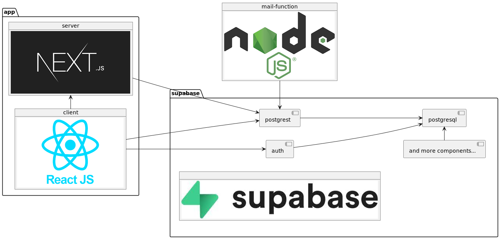

# Swiss Card Exchange

This is a student project developed by @BacLuc and @Off3line.  
The goal of the courses project is to create a cloud native e-commerce application.  
[Course page of Advanced Software Engineering @UZH](https://www.ifi.uzh.ch/en/seal/teaching/courses/ase.html)

## Github Badges:

[](https://github.com/ase-23-the-bald-owls/swiss-card-exchange/actions/workflows/ci.yml)
[](https://github.com/ase-23-the-bald-owls/swiss-card-exchange/actions/workflows/cd.yml)
[](https://github.com/ase-23-the-bald-owls/swiss-card-exchange/actions/workflows/development-setup.yml)

## SonarCloud Badges:

[](https://sonarcloud.io/summary/new_code?id=ase-23-the-bald-owls_swiss-card-exchange)
[](https://sonarcloud.io/summary/new_code?id=ase-23-the-bald-owls_swiss-card-exchange)
[](https://sonarcloud.io/summary/new_code?id=ase-23-the-bald-owls_swiss-card-exchange)
[](https://sonarcloud.io/summary/new_code?id=ase-23-the-bald-owls_swiss-card-exchange)

## Architecture

The application consist of 3 deployment units.

1. [app](app): A [NEXT.js](https://nextjs.org/) application which is the frontend of the WebShop.  
   Next.js allows to
   use [SSR](https://nextjs.org/docs/pages/building-your-application/rendering/server-side-rendering "Server Side Rendering")
   which improves [SEO](https://en.wikipedia.org/wiki/Search_engine_optimization "Search engine optimization") because
   web crawlers of search engines can parse the content without executing javascript.

2. [supabase](supabase): A container deployed with its terraform module to LocalStack.  
   It is [supabase](https://supabase.com/) self hosted with a [docker-compose.yml](supabase/app/docker-compose.yml)
   file.
   The container defined with the [Dockerfile](supabase/Dockerfile) coordinates the start of
   the [docker-compose.yml](supabase/app/docker-compose.yml) file.  
   Supabase offers [BaaS](https://en.wikipedia.org/wiki/Backend_as_a_service_(computing) "Backend as a service") which
   allows you to define a backend api
   by just defining a database [schema](app/supabase/migrations/20230315000000_create_schema.sql) with SQL. Supabase
   then analyzes this schema and
   allows to interact with the backend via [client SDK](https://supabase.com/docs/reference/javascript/insert)
   and [REST](openapi-docs.yml "OpenApi Spec").  
   The openapi specification can also be seen
   here: <https://app.swaggerhub.com/apis/LUCIUSBACHMANN/swiss-card-exchange/1>

3. [mail-function](mail-function): a [nodejs](https://nodejs.org/en) application to confirm orders via email to the
   customers.
   This is a dedicated service because this offers the retry without any additional effort, and the notification of the
   customers
   via email must be very reliable. The mail-function only needs to interact with supabase, thus it can easily be moved
   to a separate service.



These deployment units are then deployed to [LocalStack](https://localstack.cloud/). How these
units are deployed is described with [TerraFrom](https://www.terraform.io/).

Because it would be difficult to send emails to real mailboxes and the deployment target is LocalStack,
the mail-function sends the emails to [MailHog](https://github.com/mailhog/MailHog). The deployment of
MailHog is defined in the top level [docker-compose.yml](docker-compose.yml) under the service mail.

## Docker

Our setup heavily relies on docker. If you use a linux distro, make sure docker is installed according to this
guideline of docker inc: <https://docs.docker.com/engine/install/ubuntu/>.\
Maybe some features used in the Dockerfiles are not available when your docker daemon does not
use buildkit to build the containers.\
You need buildkit to build the docker images. If your docker cli does not use buildkit by default,
enable it following the guide here: <https://docs.docker.com/engine/reference/commandline/dockerd/#feature-options>.

## Local development

For local development, the local development environment with the supabase-cli is recommended.
See [app](app)

## Local deployment

To quickly build and test the docker images, a [docker-compose.yml](docker-compose.yml) file is in the
root directory.
Start the deployment with:

```shell
docker compose --profile local-run up
```

Sadly the supabase containers are not stopped when stopping the supabase-dc service.
To stop them, run:

```shell
docker compose -f supabase/app/docker-compose.yml down
```

## Deployment on LocalStack

### Setup

To deploy to the LocalStack docker compose service, you need the following tools:

- terraform [Link to install instructions](https://developer.hashicorp.com/terraform/tutorials/aws-get-started/install-cli)
- tflocal [link to install instructions](https://github.com/localstack/terraform-local)

And you need the following entries in your hosts file.
(/etc/hosts in linux, C:\Windows\System32\drivers\etc\hosts on windows)

```
127.0.0.1 s3.localhost.localstack.cloud
127.0.0.1 supabase.s3.localhost.localstack.cloud
127.0.0.1 supabase.local
```

You also need a LocalStack Pro license to start the [Amazon ECS](https://aws.amazon.com/de/ecs/) services on LocalStack.
You can obtain an educational license, which enables to use Pro features, here: [Free LocalStack Educational License](https://localstack.cloud/educational-license/).
Then run
```shell
cp .env.example .env
```
and set the LOCALSTACK_API_KEY variable to your localstack api key.

Then download the providers used by terraform: `tflocal init`

### Deploy

1. Start the LocalStack container: `docker compose up -d`
2. Refresh the terraform state: `tflocal refresh`
3. Build all images needed: `docker compose --profile local-run build`
4. Apply the changes: `tflocal apply --auto-approve`

Then, supabase should be reachable under [http://localhost:3000](http://localhost:3000)
sce-app is reachable under [http://localhost:8080](http://localhost:8080)

### Cleanup

1. Destroy the resources of terraform: `tflocal destroy --auto-approve`
2. Shut down the containers: `docker compose -f supabase/app/docker-compose.yml down`
3. Shut down LocalStack: `docker compose down`

## Documentation

To keep the documentation simple and avoid the "too long; didn't read" problem, the services follow
best coding practices for the technologies used.

**The documentation and the deployment steps above were only tested on Ubuntu 22.04, MacOS on Apple Silicon and Windows
10
with WSL 2. If you use another Setup you may encounter problems with the docker networking or with line endings on
Windows.**

In the top level directory there is the [docker-compose.yml](docker-compose.yml) which describes the contexts, arguments and image URI
to build the services. It also allows to build all services with the command `docker compose --profile local-run build`.
The [docker-compose.yml](docker-compose.yml) also contains the volumes, environment variables and network configuration to run the services.
With the ports directive the user knows under which port the service will be available.

The dockerfiles [app/Dockerfile](app/Dockerfile), [supabase/Dockerfile](supabase/Dockerfile)
and [mail-function/Dockerfile](mail-function/Dockerfile)
self contain all their build steps. There is no need to install npm packages or execute a build step before building the
image.
The Dockerfiles also declare their environment variables which allow to configure the image, their ports, their
entrypoints and
the default command.

The javascript based services have a
package.json ([app/package.json](app/package.json), [mail-function](mail-function/package.json))
which contains all the scripts that are needed to develop and run the applications.
In the [app](app) service we use typescript to document the internal interfaces between the different components.

### TerraForm

TerraForm is a rather special tool for devops. Because of that the documentation for our TerraForm modules is more
detailed. TerraForm is used that we have an executable documentation how the services are deployed to LocalStack
with more possibilities to structure the code than bash scripts.
The main.tf file in each module describes the desired state of the deployment unit in a declarative way. When a
TerraForm module is applied,
TerraForm then checks which parts already exists and which commands it has to execute to get from the current state to
the desired state.

This application consist of 4 TerraForm modules.

The top level module prepares the variables like the jwt_anon_key (the [JWT](https://jwt.io/ "JSON Web Token") for the
anonymous role of supabase) which
are shared between the sub modules. These shared variables are generated in [locals.tf](locals.tf).
As input it receives the versions of the images in should deploy with [variables.tf](variables.tf).
Then it calls the other submodules in [main.tf](main.tf). After the module is applied, TerraForm prints the variables
defined in [outputs.tf](outputs.tf) to the console. TerraForm allows to use resources implemented by external modules.
These modules and how they are configured is defined in [provider.tf](provider.tf).
The other modules [supabase/main.tf](supabase/main.tf), [app/main.tf](app/main.tf)
and [mail-function/main.tf](mail-function/main.tf)
deploy their image to LocalStack.

## Continuous Integration and Deployment

CI and CD is implemented with github actions. The workflows are defined in [.github/workflows](.github/workflows).  

[ci.yml](.github/workflows/ci.yml) lints all javascript services, lints and validates TerraForm and checks that
the generated types in [database.types.ts](app/src/lib/database.types.ts) are in sync with the schema and thus
with the api. Then it executes the [cypress.io](https://www.cypress.io/) component and e2e tests. You find
the e2e tests in [app/cypress/e2e](app/cypress/e2e). And at the end a [sonarcloud](https://sonarcloud.io/project/overview?id=ase-23-the-bald-owls_swiss-card-exchange) scan
is performed to check the coverage, code duplications and security issues. Videos and screenshots of the test run
can be seen as artifacts of the [job run](https://github.com/ase-23-the-bald-owls/swiss-card-exchange/actions/runs/4907980612) at the bottom of the summary.  

[cd.yml](.github/workflows/cd.yml) executes the deployment to LocalStack and then runs the e2e tests against
the LocalStack deployment to check if something broke in the production build.
For that it needs to build the [images](https://github.com/orgs/ase-23-the-bald-owls/packages?repo_name=swiss-card-exchange) with the [build-images.yml](.github/workflows/build-images.yml) workflow.
The nightly builds are build from the latest commit on the main branch and also provide images for the arm64 CPU architecture.

[development-setup.yml](.github/workflows/development-setup.yml) also executes productive builds of the images,
but here they are deployed with docker compose and not with LocalStack to check whether the built images ore ok,
but we have an error in the LocalStack deployment.

If you fork this repository, you need to provide the following secrets for the workflows to run:
* SONAR_TOKEN: the token of the project on sonarcloud
* GHCR_USER: The user with which you want to push the images to the ghcr.io container registry. secrets.GITHUB_TOKEN did not work,
so we made a personal access token. This is the user from which the token is generated.
* GHCR_TOKEN: The personal access token to push to the registry.
* LOCALSTACK_API_KEY
